# COMPUTAÇÃO EM NUVEM · ATIVIDADE AVALIATIVA

## Implantação de uma aplicação de três camadas com Docker

*Isolando frontend, API, banco de dados e armazenamento de objetos — só o frontend vai para a "rua".*

**Aluno:** Victor da Mata Abreu · CEULP/ULBRA

---

## Contexto

Uma pequena loja online precisa colocar sua aplicação no ar, com três camadas: uma vitrine web (frontend), uma API interna e um banco de dados. A política de segurança é inegociável: apenas a vitrine pode ser acessível pela internet — a API e o banco jamais são alcançados diretamente de fora.

A implantação abaixo isola as três camadas em uma rede Docker interna, expondo somente o frontend — reproduzindo localmente a separação entre sub-rede pública e privada estudada nos Encontros 1 a 3.

---

## Arquivos da implantação

### `docker-compose.yml`

```yaml
services:
  web:
    image: nginx:alpine
    ports:
      - "8080:80"          # Frontend publico
    volumes:
      - ./web/nginx.conf:/etc/nginx/conf.d/default.conf:ro
      - ./web/html:/usr/share/nginx/html:ro
    networks:
      - interna
    depends_on:
      - api

  api:
    image: traefik/whoami
    # Sem porta publicada: acessivel apenas pela rede interna e pelo proxy /api/
    networks:
      - interna

  banco:
    image: redis:alpine
    command: ["redis-server", "--appendonly", "yes"]
    volumes:
      - dados-banco:/data
    # Sem porta publicada: banco privado
    networks:
      - interna

  objetos:
    image: minio/minio:latest
    command: server /data --console-address ":9001"
    environment:
      MINIO_ROOT_USER: admin
      MINIO_ROOT_PASSWORD: admin12345
    ports:
      - "9001:9001"        # Console administrativo do MinIO
    volumes:
      - dados-objetos:/data
    # A API S3 do MinIO fica interna na porta 9000, sem publicacao no host
    networks:
      - interna

networks:
  interna:
    driver: bridge

volumes:
  dados-banco:
  dados-objetos:
```

### `web/nginx.conf`

```nginx
server {
    listen 80;
    server_name localhost;

    root /usr/share/nginx/html;
    index index.html;
    error_page 502 503 504 /502.html;

    # Vitrine (frontend) — arquivos estáticos
    location / {
        try_files $uri $uri/ =404;
    }

    # Proxy reverso: encaminha /api/ para o serviço interno "api"
    # A API nunca é acessada diretamente de fora, só através deste proxy.
    location /api/ {
        proxy_intercept_errors on;
        proxy_pass http://api:80/;
        proxy_set_header Host $host;
        proxy_set_header X-Real-IP $remote_addr;
        proxy_set_header X-Forwarded-For $proxy_add_x_forwarded_for;
    }

    location = /502.html {
        internal;
    }
}
```

---

## Parte prática — evidências

### Tarefa 1 — Conhecendo o serviço da API isolado

Execução do contêiner whoami isoladamente, publicando a porta 8081:

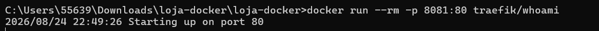

Resposta do whoami em `localhost:8081`:

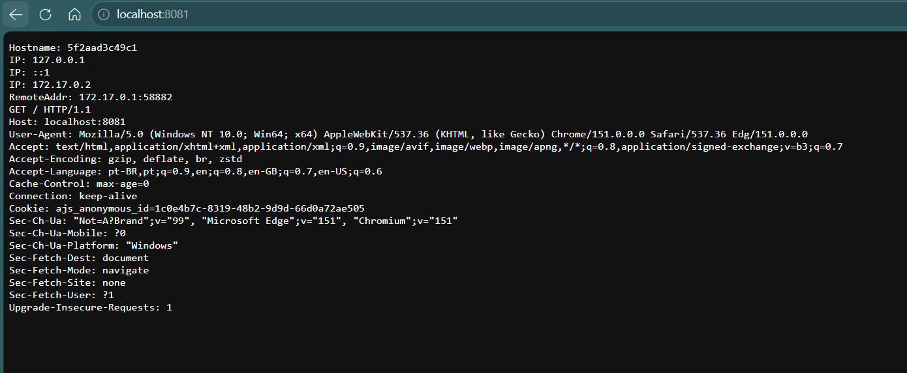

**Que informação o whoami devolve, e por que ela é útil?**

O whoami devolve o hostname (que é o ID do contêiner que respondeu), os IPs internos, o IP de quem fez a requisição (RemoteAddr) e os cabeçalhos HTTP recebidos. Essa informação é útil porque o hostname muda de contêiner para contêiner — então, ao repetir a requisição contra várias instâncias (como no proxy da Tarefa 3 ou atrás de um balanceador), dá para provar exatamente qual contêiner atendeu cada chamada.

### Tarefas 2, 3 e 4 — Subindo a stack completa

Com `docker compose up -d`, apenas o serviço `web` publica porta no host (8080:80); `api` e `banco` ficam somente na rede interna, sem porta publicada — confirmando a separação público/privada:

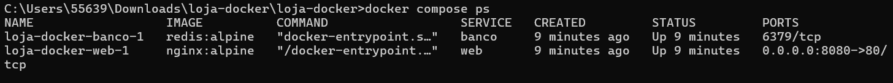

Teste do banco de dados de dentro da rede Docker (o host não tem porta para acessá-lo diretamente):

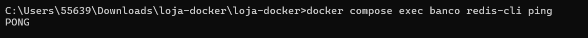

**Por que a API sem porta publicada — acessível só via `/api` pelo frontend — reproduz uma sub-rede privada?**

Porque ela só é alcançável por outros contêineres da mesma rede Docker, assim como uma sub-rede privada só é alcançável de dentro da VPC. Não existe rota do host/internet até ela — o único caminho é através do proxy reverso do `web`, exatamente como uma sub-rede privada que só recebe tráfego roteado internamente, nunca direto da internet.

### Tarefa 5 — Teste de isolamento de falhas por camada

Parando a API de propósito:

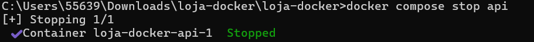

Com a API parada, a rota `/api` passa a retornar 502 Bad Gateway, mas a vitrine (home) continua no ar normalmente:

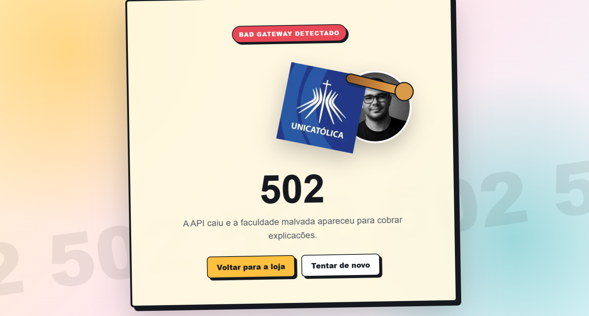

**Por que a home continuou no ar enquanto `/api` caiu? Relação com alta disponibilidade (Encontro 3)?**

Porque cada camada roda em um contêiner isolado, sem dependência de runtime entre elas: o nginx (frontend) só falha ao tentar repassar a requisição via `proxy_pass` para a API — o restante do site continua servindo normalmente. Isso é isolamento de falha por camada, o mesmo princípio por trás de espalhar aplicações em várias zonas de disponibilidade: a queda de um componente não deveria arrastar o sistema inteiro para baixo.

### Tarefa 6 — Persistência do banco (armazenamento de bloco)

Sequência completa: subir a stack, gravar um dado no Redis, derrubar tudo com `down`, subir de novo e confirmar que o dado sobreviveu graças ao volume `dados-banco`.

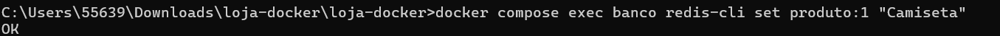

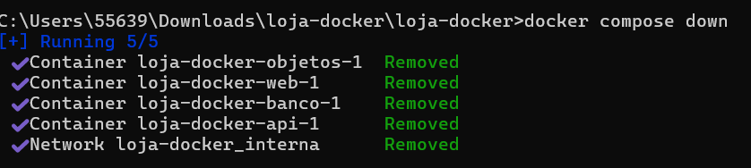

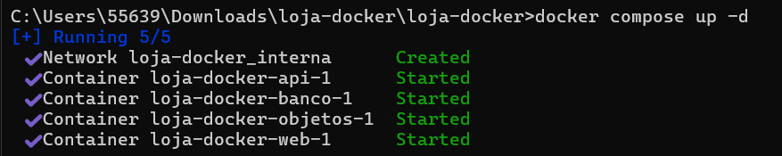

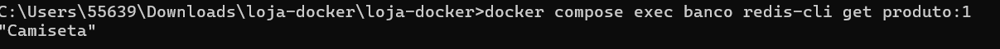

**Sem o volume, o que aconteceria com o dado após o `down`? Relação com bloco e durabilidade.**

Sem o volume, o dado morreria junto com o contêiner: o `redis-cli set` grava na camada de escrita do próprio contêiner, que é efêmera, e o `docker compose down` remove o contêiner — perdendo tudo junto. O volume desacopla o dado do ciclo de vida do contêiner, exatamente como um disco de bloco (EBS) continua existindo mesmo que a VM seja terminada. É esse desacoplamento que garante durabilidade ao dado, independente da instância que o processa estar de pé ou não.

### Tarefa 7 — Armazenamento de objetos (MinIO)

Bucket `produtos` criado no console do MinIO (`localhost:9001`) com a primeira imagem enviada:

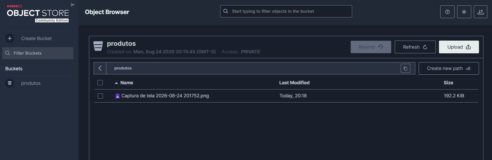

**Por que a imagem do produto vai para o armazenamento de objetos e não para o banco?**

Imagem é um arquivo binário grande, acessado por URL/HTTP, sem necessidade de consultas relacionais — exatamente o padrão de acesso do armazenamento de objetos (S3/MinIO), que escala "infinitamente" e é otimizado para servir arquivos estáticos. O bloco (o volume do Redis) é voltado a dados estruturados de baixa latência, montados por um único serviço; não faz sentido guardar binários grandes ali, o que encareceria o disco e ainda não teria como servir a imagem direto por URL como o MinIO faz.

### Tarefa 8 — Versionamento dos objetos

Versionamento ativado no bucket `produtos` via `mc` (linha de comando, já que a opção não estava visível no console desta versão):

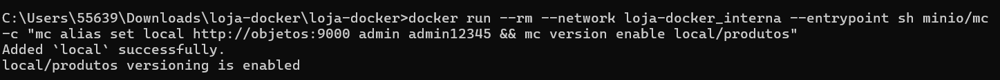

Upload de uma segunda imagem com o mesmo nome (`foto.png`), sobrescrevendo a anterior:

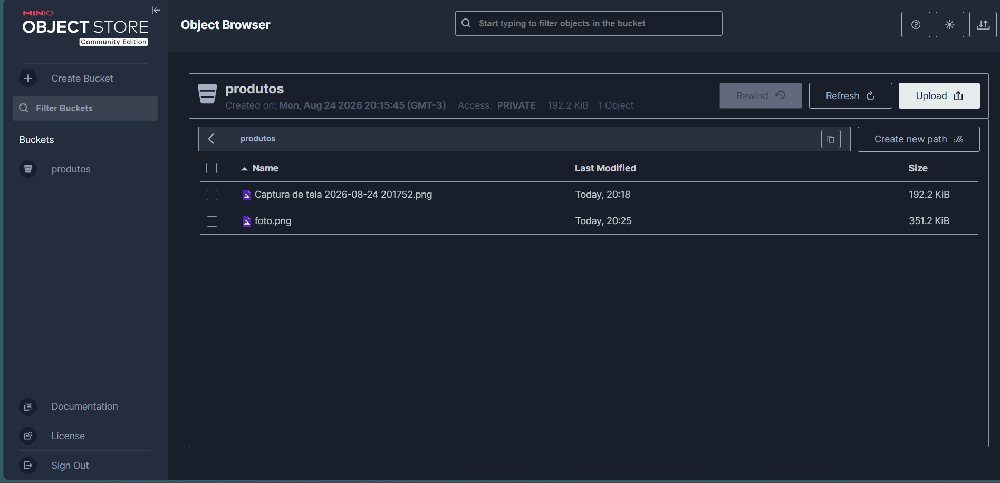

Listagem de todas as versões do objeto pelo `mc`, provando que a versão antiga não foi perdida:

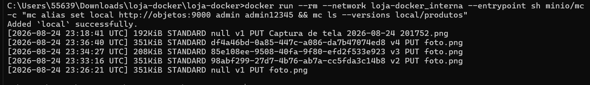

**Como o versionamento protege contra erro humano, e que política evitaria custo eterno com versões antigas?**

O versionamento protege porque, ao sobrescrever `foto.png`, a versão antiga não desaparece — ela vira uma versão anterior recuperável (visível na listagem com Version IDs distintos), evitando perda definitiva por erro humano, o mesmo tipo de acidente do "bucket vazado" do Encontro 1, só que por sobrescrita em vez de exposição indevida. Como versões antigas ocupam espaço e custam para sempre, a política correta é uma regra de ciclo de vida que expire automaticamente versões antigas após um número definido de dias, evitando pagar indefinidamente por dados que só existem como rede de segurança.

---

## Análise escrita

### 1. Sub-rede pública x privada na nuvem

Levando esta aplicação para a nuvem, apenas o `web` (frontend) ficaria na sub-rede pública, atrás de um grupo de segurança abrindo somente a porta 443 (ou 80, se sem TLS). A `api`, o `banco` e o MinIO ficariam na sub-rede privada, sem IP público, alcançáveis apenas internamente pelo frontend (ou por uma VPN/bastion, no caso do console administrativo do MinIO).

### 2. Responsabilidade compartilhada

Manter o banco fechado ao mundo é responsabilidade do cliente (minha). O provedor garante o isolamento físico e lógico da infraestrutura subjacente, mas a configuração de rede — sub-redes, grupos de segurança, quem publica porta e quem não publica — é decisão e responsabilidade de quem opera o IaaS.

### 3. Tolerância a falha da API

Um balanceador de carga na frente de múltiplas instâncias/réplicas da API, com health check, resolveria o problema: se uma instância cair, o balanceador para de enviar tráfego para ela e direciona as requisições para as demais, evitando que a queda de uma única instância derrube a rota `/api` inteira — o mesmo mecanismo visto no Encontro 3.

### 4. Vantagens de isolar API e banco

- Reduz a superfície de ataque: a API e o banco não podem ser atacados ou escaneados diretamente pela internet, só através do proxy controlado do frontend.
- Permite atualizar, reiniciar ou depurar uma camada sem expor ou derrubar as outras, aplicando o princípio de menor privilégio já visto nos grupos de segurança.

### 5. Volume do banco como armazenamento de bloco

O volume `dados-banco` corresponde a um armazenamento de bloco porque é um espaço de disco bruto montado por um único serviço (o Redis), da mesma forma que um EBS é montado por uma única VM. Sem ele, os dados gravados existiriam apenas na camada de escrita efêmera do contêiner e desapareceriam assim que o contêiner fosse removido (`docker compose down`) — perdendo toda durabilidade.

### 6. Por que imagens vão para objeto e não para o banco

As imagens dos produtos vão para o MinIO (armazenamento de objetos) porque são arquivos binários acessados por URL/HTTP, sem necessidade de consultas relacionais, e porque esse tipo de armazenamento escala de forma praticamente ilimitada e é otimizado para servir mídia estática — diferente do banco, feito para dados estruturados de baixa latência.

### 7. Versionamento e política de ciclo de vida

O versionamento protege contra erro humano porque uma sobrescrita não apaga a versão anterior — ela continua recuperável, como ficou visível na listagem com múltiplos Version IDs para o mesmo arquivo. Para versões antigas não custarem caro para sempre, a política certa é uma regra de ciclo de vida que expire automaticamente versões não-atuais após um prazo definido (por exemplo, 30 dias), equilibrando proteção contra erro com custo de armazenamento.

---
# Loja Docker

Projeto de atividade avaliativa de Computacao em Nuvem com uma aplicacao em tres camadas usando Docker Compose.

## Servicos

- `web`: frontend publico com nginx, publicado em `http://localhost:8080`
- `api`: API interna com `traefik/whoami`, acessivel pelo proxy em `http://localhost:8080/api/`
- `banco`: Redis privado, com volume persistente `dados-banco`
- `objetos`: MinIO para armazenamento de objetos, com console em `http://localhost:9001`

## Como executar

```powershell
docker-compose up -d
```

## Testes uteis

```powershell
docker-compose ps
docker-compose exec banco redis-cli ping
docker-compose exec banco redis-cli set produto:1 "Camiseta"
docker-compose exec banco redis-cli get produto:1
```

## MinIO

- Console: `http://localhost:9001`
- Usuario: `admin`
- Senha: `admin12345`

## Encerrar

```powershell
docker-compose down
```

*Entrega finalizada com `docker compose down` ao término dos testes.*
